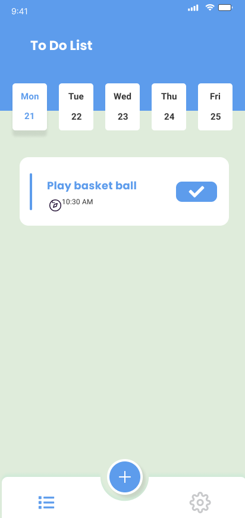
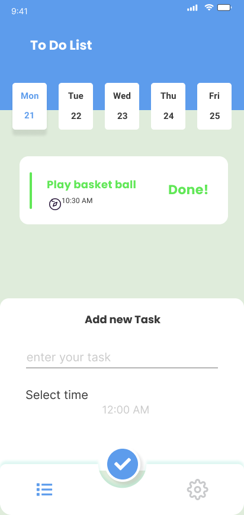
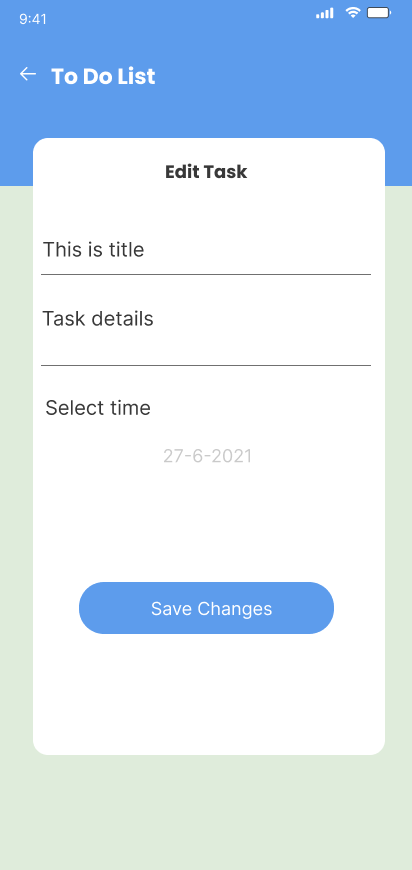
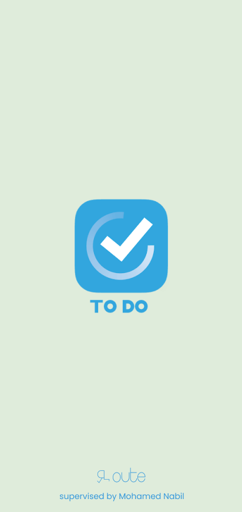
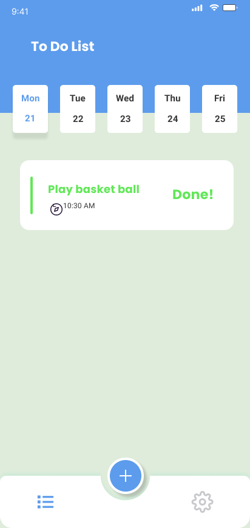
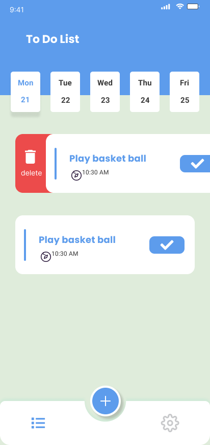
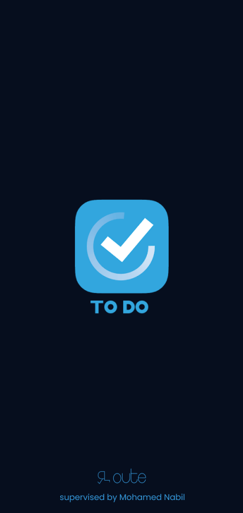
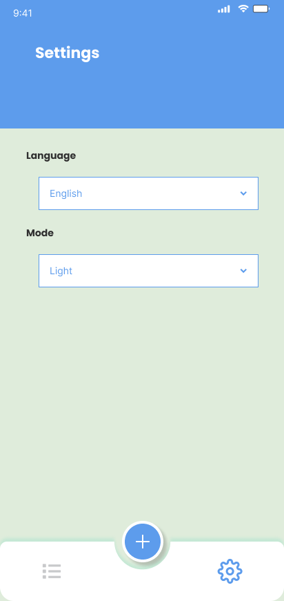
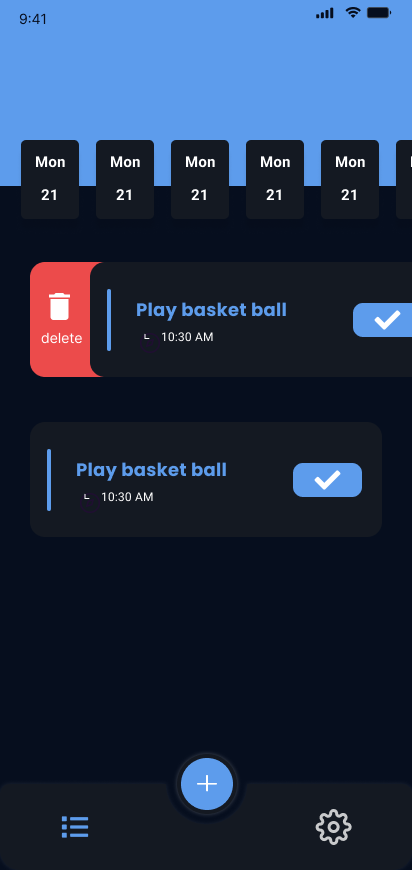

# To-Do List App

## 📑 Table of Contents

1. [🚀 Introduction](#-introduction)
2. [🛠 Installation & Setup](#-installation--setup)
3. [🤝 Contribution Guide](#-contribution-guide)
4. [🖥️ Technical Stack](#️-technical-stack)
5. [🎥 Demo Video](#-demo-video)
6. [🛠 Features](#-features)
7. [📷 Screenshots](#-screenshots)
8. [👥 Contributors](#-contributors)

## 🚀 Introduction

A modern, feature-rich To-Do List application built with Flutter. The app offers a clean, intuitive
interface for managing daily tasks with features like task scheduling, dark mode support, and
multiple language options.

## 🛠 Installation & Setup

To run this project locally, follow these steps:

### Prerequisites

- **Flutter SDK**: Make sure you have Flutter
  installed. [Download Flutter](https://flutter.dev/docs/get-started/install)
- **Firebase Account**: Set up a Firebase project for authentication and data storage
- **IDE**: Android Studio, VS Code, or IntelliJ IDEA with Flutter plugins installed
- **Device/Emulator**: Physical device or emulator for testing

### Steps

1. Clone the repository:
   ```bash
   git clone https://github.com/Mohammedhussein12/todo_app.git
   cd todo-list-app
   ```

2. Install dependencies:
   ```bash
   flutter pub get
   ```

3. Configure Firebase:
    - Add your `google-services.json` (Android) and `GoogleService-Info.plist` (iOS)
    - Enable Authentication and Firestore in Firebase Console

4. Run the app:
   ```bash
   flutter run
   ```

## 🤝 Contribution Guide

We welcome contributions! Here's how you can help:

1. Fork the repository
2. Create your feature branch: `git checkout -b feature/amazing-feature`
3. Commit your changes: `git commit -m 'Add amazing feature'`
4. Push to the branch: `git push origin feature/amazing-feature`
5. Open a Pull Request

## 🖥️ Technical Stack

### **Core Technologies**

- **Flutter**: Primary framework for cross-platform development
- **Dart**: Programming language
- **Firebase**: Backend services and authentication

### **State Management & Dependencies**

- **Provider**: For state management across the app
- **Shared Preferences**: Local data storage for app settings

### **Firebase Services**

- **Firebase Core**: Core Firebase functionality
- **Cloud Firestore**: Database for storing tasks and user data
- **Firebase Auth**: User authentication and management

### **UI Components & Styling**

- **Flutter Slidable**: Implements slidable list items for task deletion
- **Google Fonts**: Custom typography
- **Cupertino Icons**: iOS-style icons
- **Easy Date Timeline**: Timeline visualization for task scheduling

### **Localization & Internationalization**

- **Flutter Localizations**: Base localization support
- **Intl**: Internationalization and localization support

### **Utilities**

- **Fluttertoast**: Toast message notifications

## 🎥 Demo Video

Watch the demo video to see the application in action:
*
*[Demo Video Link](https://drive.google.com/file/d/1qM-uyNBN7rO5kNA-NGCgiwH1XOD9QEO7/view?usp=drive_link)
**

## 🛠 Features

### 📝 Task Management

- Create, edit, and delete tasks
- Mark tasks as complete
- Set task due dates and times
- Task persistence using Firebase
- Swipe-to-delete functionality

### 📅 Timeline View

- Weekly calendar view
- Daily task overview
- Easy date navigation
- Visual task scheduling

### 🎨 User Interface

- Clean, modern design
- Dark and light mode support
- Intuitive task creation
- Smooth animations and transitions
- Responsive layout

### 🌐 Localization

- Multi-language support
- Easy language switching
- RTL support for applicable languages

### 👤 User Features

- User authentication
- Personal task lists
- Settings customization

### ⚡ Performance

- Offline support
- Quick task updates
- Efficient data synchronization
- Smooth scrolling and interactions

## 📷 Screenshots

| Home Screen                          | Add Task                                     | Edit Task                                      |
|--------------------------------------|----------------------------------------------|------------------------------------------------|
|  |  |  |

| Splash Light Mode                                  | Task Done                                      | Delete Task Light Mode                                        |
|----------------------------------------------------|------------------------------------------------|---------------------------------------------------------------|
|  |  |  |

| Splash Dark Mode                                             | Settings                                     | Delete Task Dark Mode                                                  |
|--------------------------------------------------------------|----------------------------------------------|------------------------------------------------------------------------|
|  |  |  |

## 👥 Contributors

- **Mohammed Hussein** ([Mohammedhussein12](https://github.com/Mohammedhussein12))